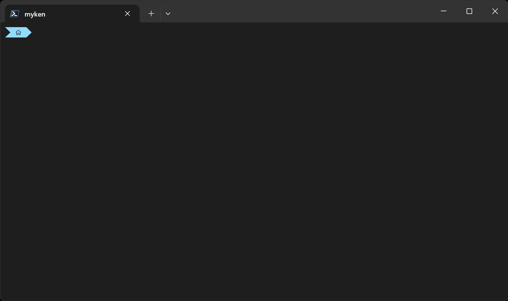

# tintcd

Spatial memory for your terminal. Each directory gets a stable, deterministic background
tint.



## Install

```powershell
Install-Module tintcd
```

## Why

I always have several terminal windows open in different folders. I'd alt-tab back, squint at the prompt, and wonder if I'm still in the right place. The prompt alone wasn't enough. I wanted something low-effort: no manual config, no color-picking — just instant "wait, wrong folder!" recognition or a warm and fuzzy "ah yes, this one."

## What it does

When you change directories, tintcd hashes the path and applies a unique background
color via OSC 11. Every directory gets a stable, visually distinct identity — no
configuration needed. It also exports `$env:TINTCD_ACCENT` for prompt integration.

## Quick Start

Add to your `$PROFILE`:

```powershell
Import-Module tintcd
Enable-TintcdPromptHook
```

That's it! Every directory change now applies theming automatically.

With oh-my-posh (must init BEFORE tintcd):

```powershell
oh-my-posh init pwsh --config "path/to/theme.json" | Invoke-Expression
Import-Module tintcd
Enable-TintcdPromptHook
```

**Not working?** Run `tintcd -Status` to diagnose.

## Usage modes

**Auto mode** (recommended): `Enable-TintcdPromptHook` wraps your prompt. Tinting happens on every directory change — whether via `cd`, `pushd`, `Set-Location`, or scripts.

**Manual mode**: Use `tintcd` as your cd command. Only tints when you explicitly call it.

## Commands

All functionality is accessed through the unified `tintcd` command:

```powershell
tintcd C:\foo              # Navigate + tint
tintcd -Reload             # Reload config + refresh tint
tintcd -Preview            # Preview colors for sample paths
tintcd -Preview /foo, /bar # Preview colors for specified paths
tintcd -Hook               # Install prompt hook (setup)
tintcd -Unhook             # Remove prompt hook
tintcd -Disable            # Pause tinting for session
tintcd -Enable             # Resume tinting
tintcd -Status             # Show status and diagnose issues
```

Also exported: `Enable-TintcdPromptHook` (for $PROFILE), `Get-TintcdConfig` (for scripts)

## Configuration

Create `~/.tintcd.json` (or set `$env:TINTCD_CONFIG`): 

```json
{
  "BackgroundLightness": [0.08, 0.14],
  "AccentLightness": [0.45, 0.65],
  "Saturation": [0.35, 0.55],
  "DefaultBackground": "1e1e1e",
  "Enabled": true
}
```

All keys are optional — missing keys use defaults.

**Light mode?** Set `BackgroundLightness` to `[0.88, 0.94]` and `AccentLightness` to `[0.35, 0.50]`.

## oh-my-posh Integration

tintcd exports `$env:TINTCD_ACCENT` (a brighter version of the background color) for
prompt integration. Use it in your theme:

```json
"background_templates": [
  "{{ if .Env.TINTCD_ACCENT }}{{ .Env.TINTCD_ACCENT }}{{ end }}"
]
```

See [`examples/agnoster-tintcd.omp.json`](examples/agnoster-tintcd.omp.json) for a complete theme.

## How it works

```
Path → SHA256 hash → first 3 bytes → HSL color
                                      ↓
                     Background: dark (L=0.08-0.14) → OSC 11
                     Accent: bright (L=0.45-0.65) → $env:TINTCD_ACCENT
```

HSL ensures consistent visibility: all backgrounds are equally dark, all accents equally bright. Only the hue varies per directory.

## Requirements

- PowerShell 7.0+
- Windows Terminal or VS Code (for OSC 11 background support)

`$env:TINTCD_ACCENT` is set in any terminal, so prompt themes can use it even without OSC 11 support.

## Limitations

- **Overrides transparency/background images** — OSC 11 replaces any custom terminal background. Use `tintcd -Disable` to preserve.
- **Dark mode default** — Default lightness ranges assume dark terminals. See Configuration for light mode values.
- **Color contrast** — Tinted backgrounds may affect readability of colored text. Windows Terminal's `adjustIndistinguishableColors` setting (enabled by default) helps.
- **oh-my-posh only** — Prompt integration is tested with oh-my-posh. Starship/others may work via `$env:TINTCD_ACCENT` but is not tested.

## Contributing

Contributions welcome!

Tests: `Invoke-Pester` — config validation only, keeping it minimal.

## License

MIT

---

*cd, but colorful.*

<sub>Inspired by
[Peacock](https://marketplace.visualstudio.com/items?itemName=johnpapa.vscode-peacock).
Vibe-engineered with Claude, reviewed by ChatGPT, Gemini, and other Claude.</sub>
